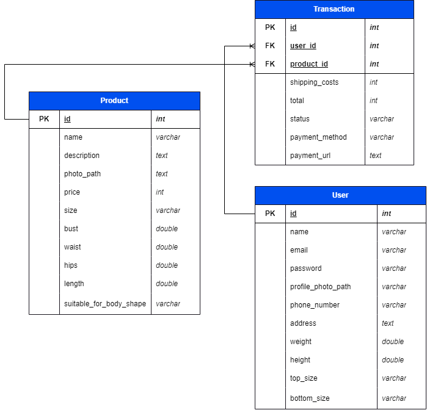
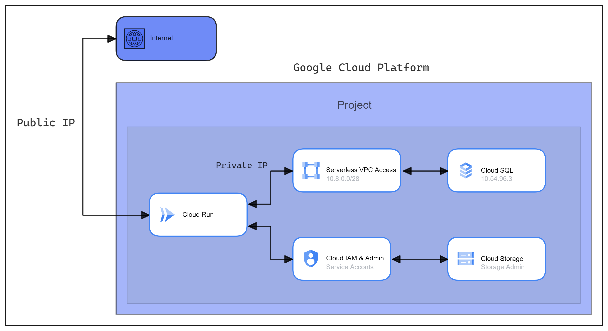

## Rentaloca - Backend-API

Product-based Capstone, Bangkit 2023 Batch 1

## Build with

- [PHP](https://www.php.net/docs.php).
- [Laravel](https://laravel.com).
- [Sanctum](https://laravel.com/docs/10.x/sanctum).
- Google Cloud Storage filesystem driver.
- [MySQL](https://dev.mysql.com/doc/).

## Started

- Clone repo `git clone https://github.com/Rentaloca/rentaloca-api.git`
- Install Package `composer install`
- Add service account key from gcp
- Create database
- Copy and set env `cp .env.example .env`
- `php artisan key:generate`
- `php artisan migrate`
- `php artisan serve`

## Postman Documentation

[https://documenter.getpostman.com/view/18351670/2s93sXcuNG](https://documenter.getpostman.com/view/18351670/2s93sXcuNG).

## Deployment on Google Cloud Platform

- Backend API on [Cloud Run](https://cloud.google.com/run/docs).
- Database on [Cloud SQL](https://cloud.google.com/sql/docs).
- Storage on [Cloud Storage](https://cloud.google.com/storage/docs).
- Connection with Cloud SQL using [Serverless VPC Access](https://cloud.google.com/vpc/docs/configure-serverless-vpc-access).
- Connection with Cloud Storage using [Service Account](https://cloud.google.com/iam/docs/keys-create-delete).

## License

Copyright (c) 2023 - Rentaloca Bangkit Product-based Capstone

